# 📝 Relatório – App Inventor

## Instituição  
ETEC Vasco Antônio Venchiarutti  

## Curso  
Desenvolvimento de Sistemas  

## Turma  
2°C1 - Turma B  

## Autores  
Maria Eduarda Nascimento dos Santos  
Mariana da Silva Gonçalves  

---

# Projeto 1 – Primeiro Aplicativo (pg. 27)

## Descrição  
O objetivo do aplicativo é exibir uma mensagem ao clicar em um botão.  

O aplicativo possui um botão **“Clique Aqui!!!!”**, que ao ser pressionado mostra a mensagem **“Hello World!!! :D”** acima de uma imagem. Também contém dois botões adicionais:  
- **Limpar:** remove a mensagem exibida  
- **Fechar:** encerra o aplicativo  

### Modificações em relação à apostila  
- Alteração da imagem  
- Mudança de cores  
- Alteração do texto exibido  

## Print das telas do Design  
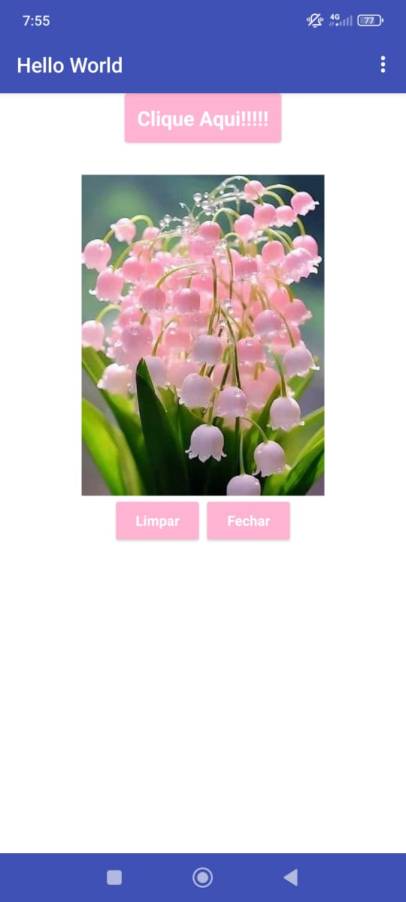
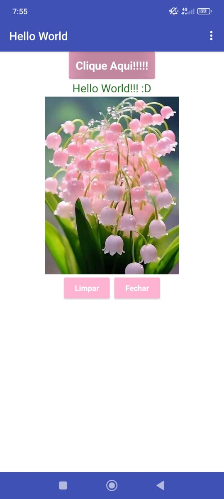

## Print das telas dos Blocos  
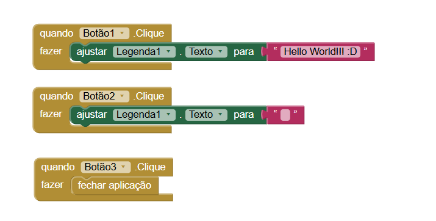

---

# Projeto 2 – Segundo Aplicativo (pg. 46)

## Descrição  
O objetivo do aplicativo é permitir desenhar na tela com diferentes cores.  

O aplicativo possui quatro botões:  
- Vermelho  
- Verde  
- Azul  
- Amarelo  

Ao clicar em qualquer um deles, o usuário pode desenhar na tela com a cor escolhida. Também há um botão **“Limpar”**, que apaga o desenho.  

### Modificações em relação à apostila  
- Alteração da imagem utilizada  

## Print das telas do Design  
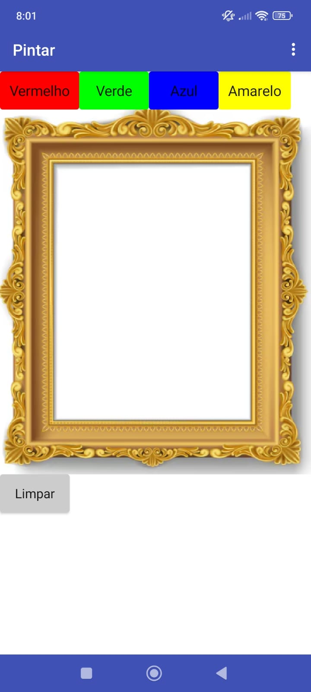
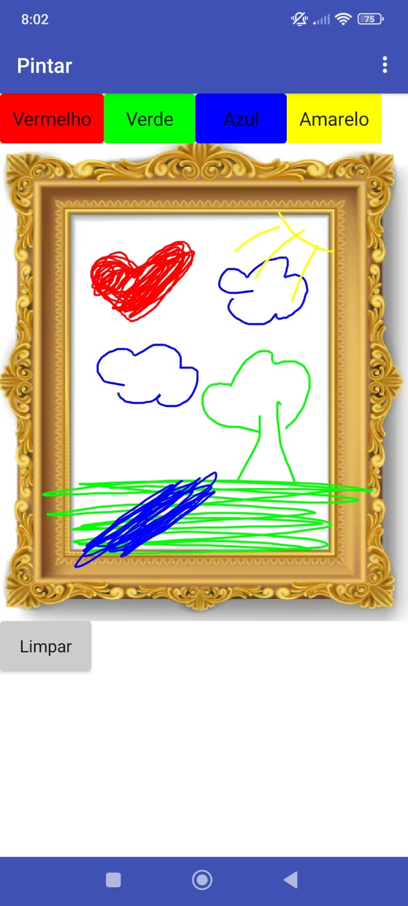

## Print das telas dos Blocos  
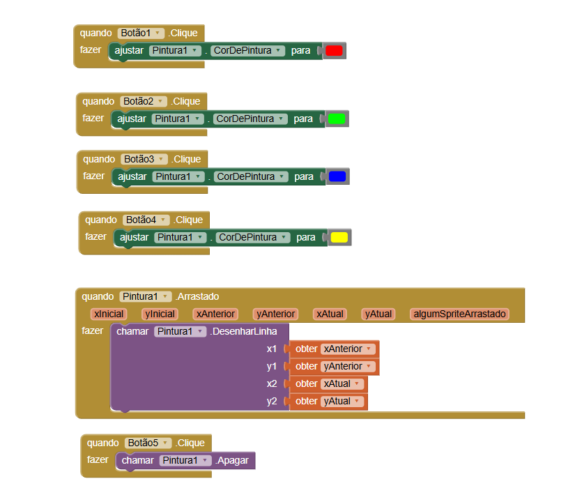

---

# Projeto 3 – Terceiro Aplicativo (pg. 56)

## Descrição  
O objetivo do aplicativo é interagir com o usuário através de som e vibração.  

O app apresenta a imagem de um liquidificador. Ao clicar na imagem:  
- Um som é reproduzido  
- O celular vibra    

## Print das telas do Design  
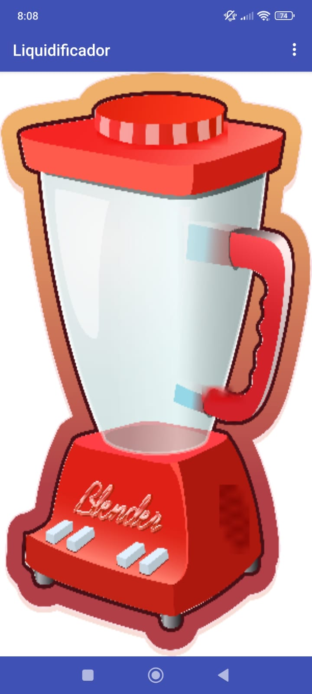

## Print das telas dos Blocos  
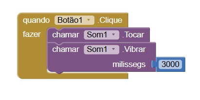

---

# Projeto 4 – Quarto Aplicativo (pg. 64)

## Descrição  
O objetivo do aplicativo é utilizar a câmera do celular.  

O app permite:  
- Tirar uma foto usando a câmera  
- Visualizar a imagem capturada na tela principal   

## Print das telas do Design  
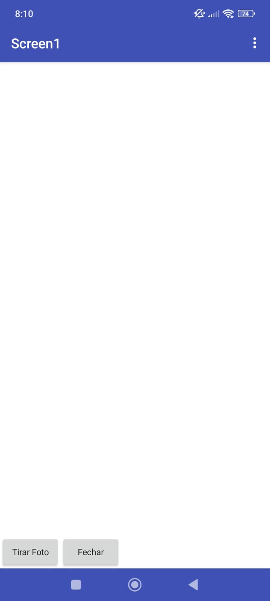
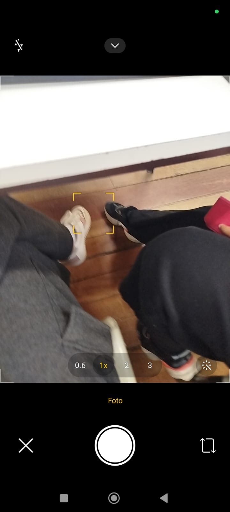
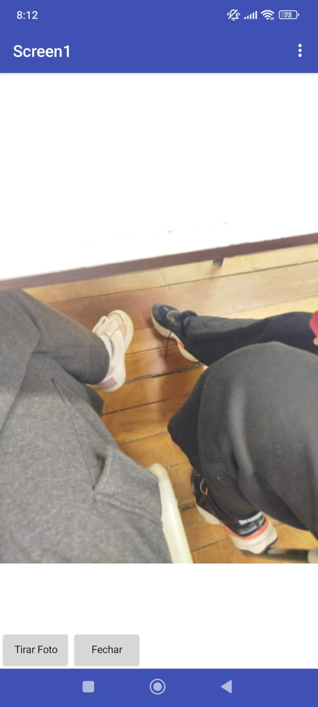

## Print das telas dos Blocos  
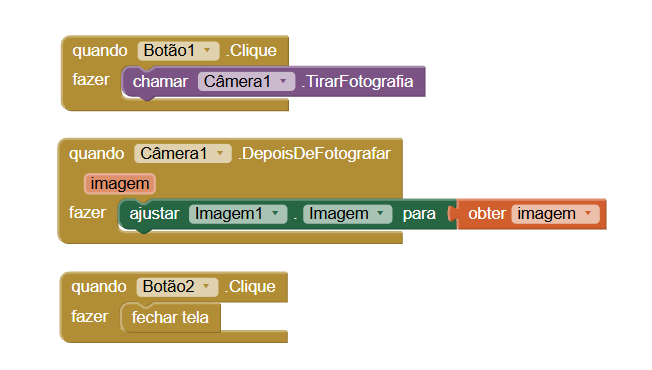

---

# Projeto 5 – Quinto Aplicativo (pg. 69)

## Descrição  
O objetivo do aplicativo é trabalhar com múltiplas telas.  

O app inicia com uma tela principal contendo dois botões:  
- **Tela 1**  
- **Tela 2**  

### Funcionamento  
- Ao clicar em **Tela 1**:  
  - Abre uma nova tela com uma imagem  
  - Botão “Voltar ao Início”  

- Ao clicar em **Tela 2**:  
  - Abre uma nova tela com uma imagem  
  - Botões:  
    - Voltar ao Início  
    - Voltar à Tela 1  

### Modificações em relação à apostila  
- Adição de imagens de fundo  
- Alteração das cores dos botões  

## Print das telas do Design  
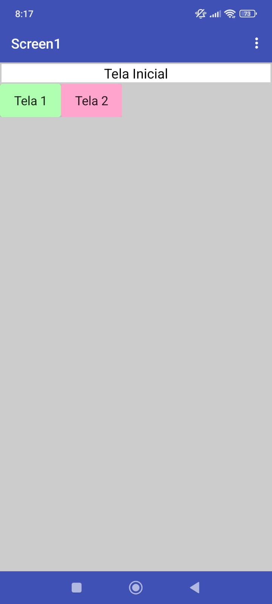  
  
  

## Print das telas dos Blocos  
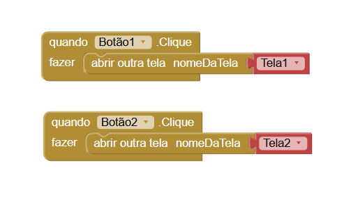  
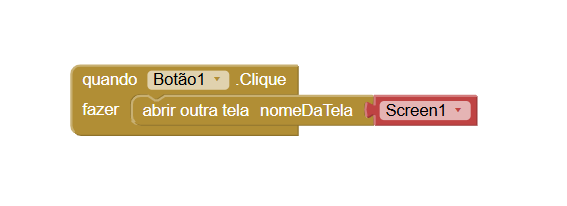  
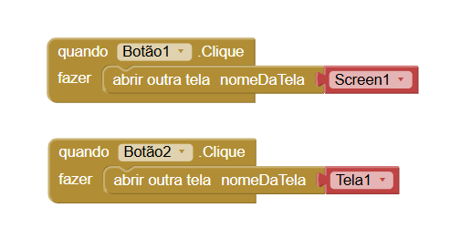  

---

# Projeto 6 – Sexto Aplicativo (pg. 82)

## Descrição  
O objetivo do aplicativo é interagir com entrada de texto do usuário.  

O app possui:  
- Uma caixa de texto  
- Um botão “Digite seu nome e clique aqui!”  

### Funcionamento  
Ao digitar um nome (exemplo: Maria) e clicar no botão, o app exibe a mensagem:  
**“Olá Maria!!!!”**   

## Print das telas do Design  
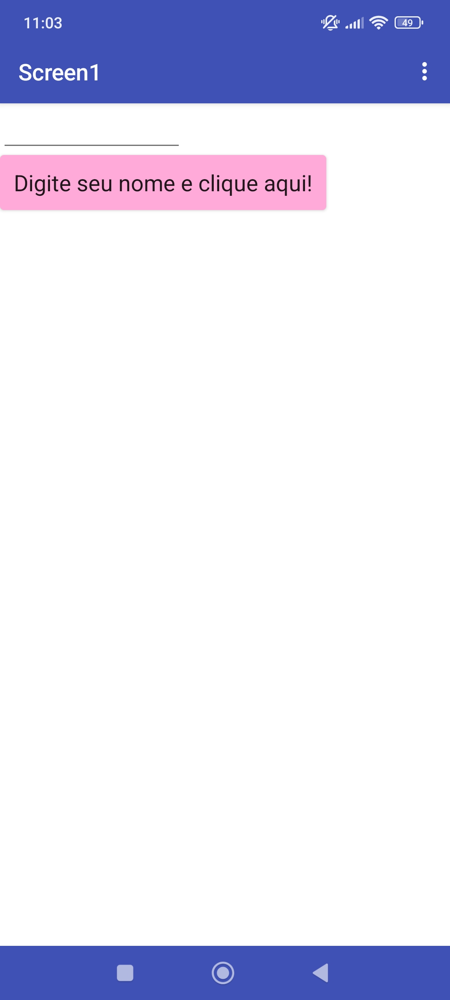

## Print das telas dos Blocos  
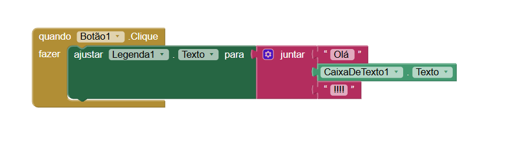

---

# 📊 Conclusão  
Através deste trabalho foi possível aprender conceitos importantes do MIT App Inventor, como criação de interfaces, uso de eventos, múltiplas telas e interação com o usuário.