# 📝 Relatório - Jogos no APP Inventor

## Instituição
ETEC Vasco Antônio Venchiarutti

## Curso
Desenvolvimento de Sistemas

## Turma
2°C1 - Turma B

## Autores
- Maria Eduarda Nascimento dos Santos
- Mariana da Silva Gonçalves

---

# Projeto 1: Acelerômetro 

## Descrição
O jogo mostra as coordenadas do celular de acordo com os eixos x, y e z, conforme o celular se move. Quando o celular é chacoalhado as cores do fundo das coordenadas mudam.

### Print da Tela
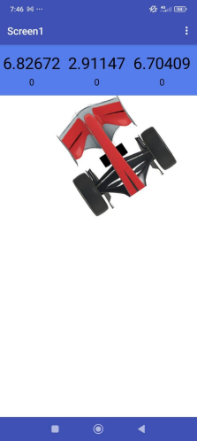
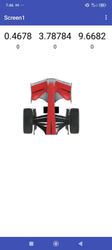
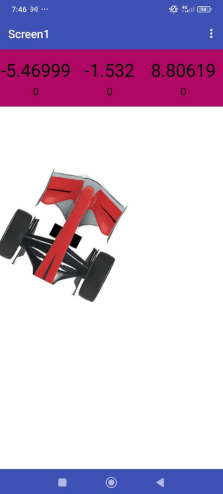

### Print dos Blocos
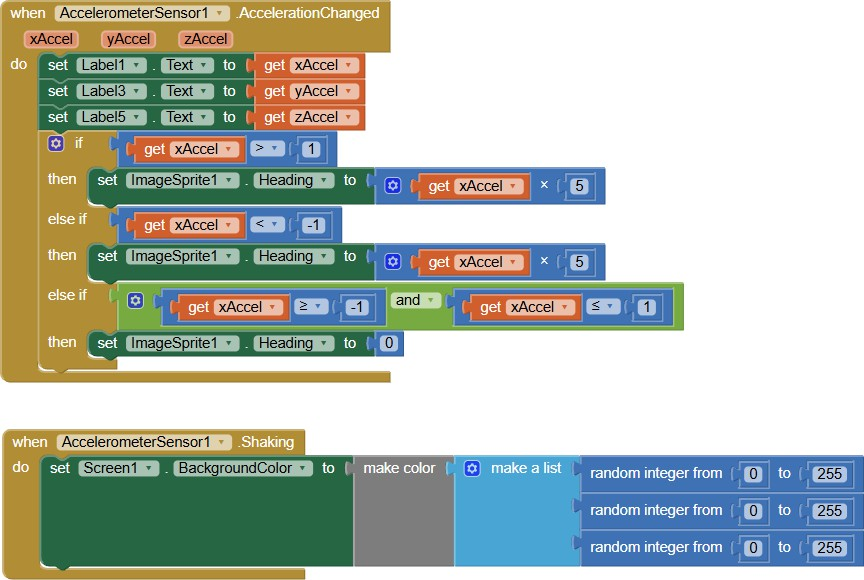

---

# Projeto 2: Magic Ball

## Descrição
O jogo tem como objetivo colocar a bola dentro do buraco, usando a função do acelerômetro do APP Inventor. A bola deve tocar no buraco 20 vezes dentro de 1 minuto. Se a pessoa não conseguir, aparece uma mensagem de game over e o jogo recomeça.

### Print da Tela
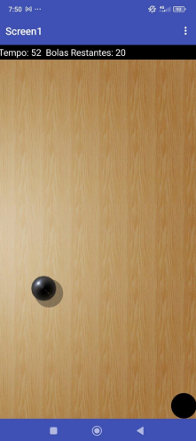
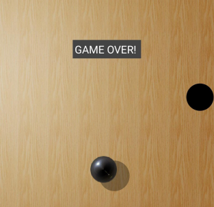

### Print dos Blocos
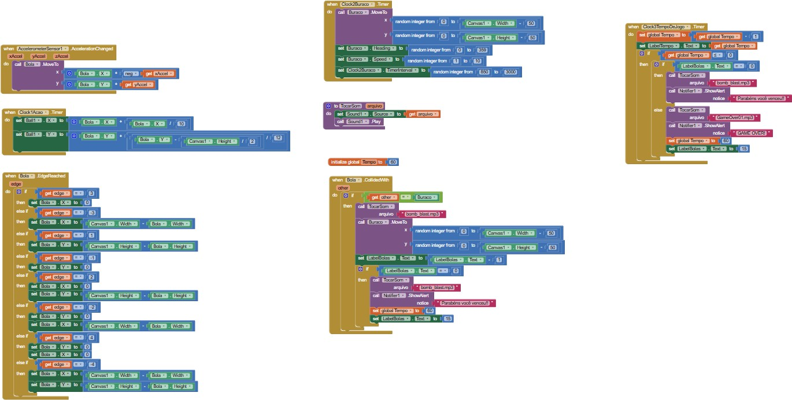

---

# Projeto 3: Dado Mágico

## Descrição 
O jogo consiste em clicar no botão "sortear" onde um número é sorteado aleatoriamente, como um dado de verdade.

### Print da Tela
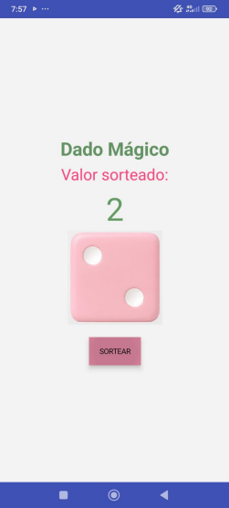
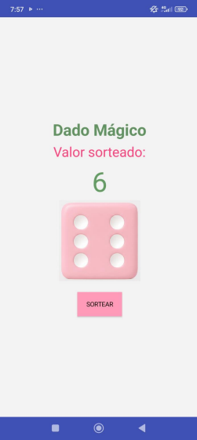

### Print dos Blocos
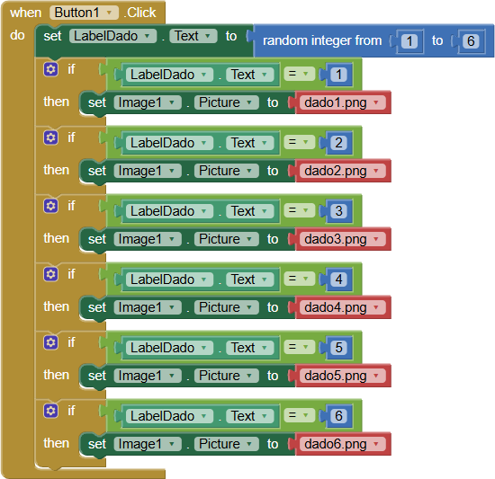

---

# Projeto 4: Jogo Adivinha

## Descrição
O jogo representa contas de mais(+), menos(-) e multiplicação(*). Se a pessoa acertaro resultado da conta aparece uma mensagem "Você acertou!" sendo somado um ponto aos acertos. Se ela errar, aparece uma mensagem "Você errou! O resultado correto seria: (resposta correta)" sendo somado um ponto aos erros.

### Print da Tela
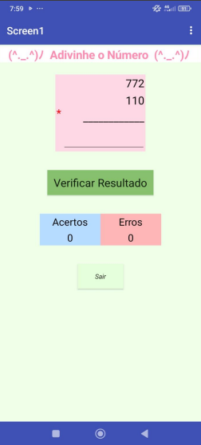
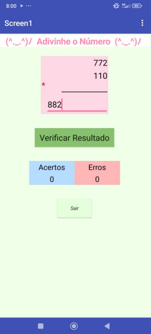
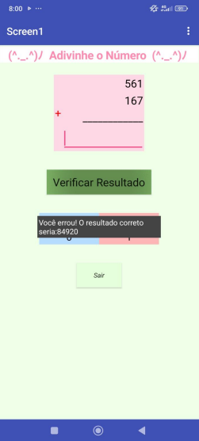
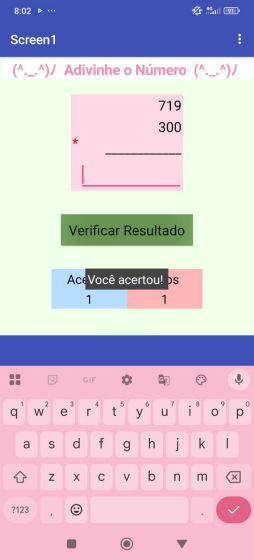

### Print dos Blocos
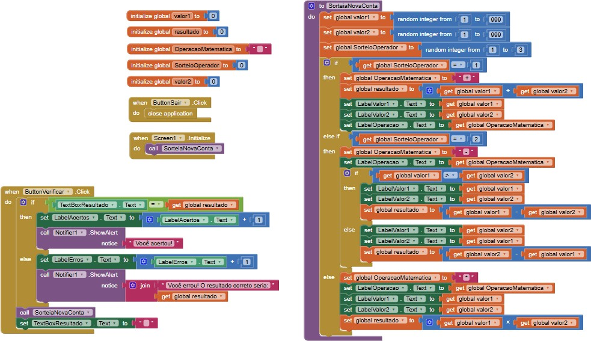

---

# Projeto 5: Pong Master

## Descrição
Quando o jogo começa, a bolinha rebate na barra vermelha e o objetivo é acertar os blocos cinzas na parte de cima da tela. Quando um bloco é quebrado, é somado um ponto. E quando todos os cinco blocos iniciais são quebrados eles reaparecem, continuando assim o jogo.

### Print da Tela
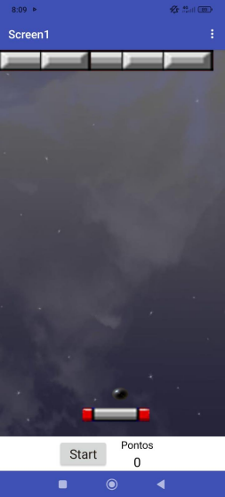
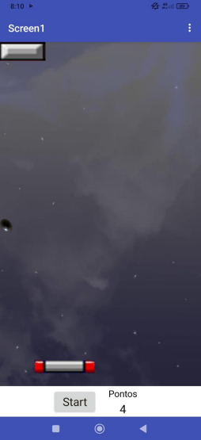
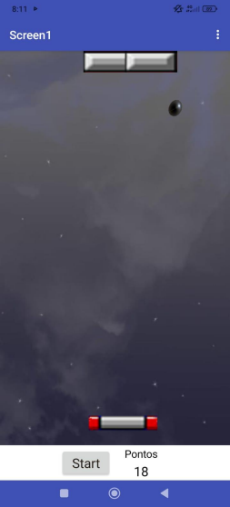

### Print dos Blocos
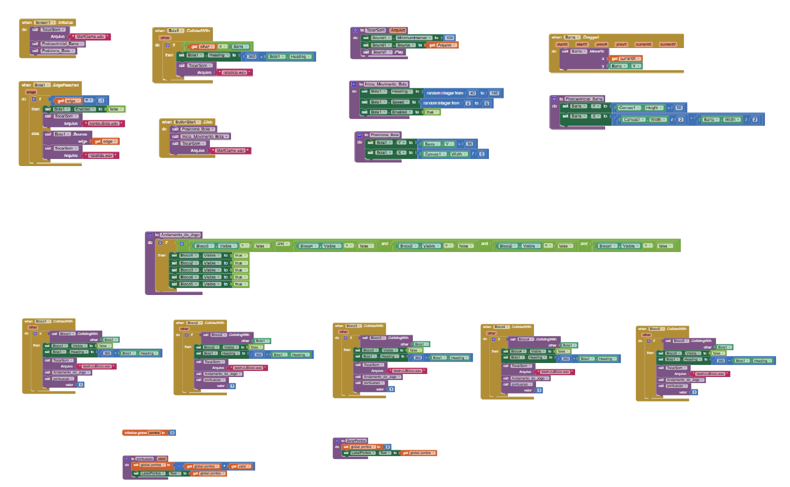

---

# Projeto 6: Jogo Bilharzinho

## Descrição
O objetivo do jogo é acertar a bola branca dentro das caçapas da imagem da mesa. Tanto a bola branca, quanto as caçapas são feitas com "ball" do APP Inventor. Quando eles colidem, a bola volta para o meio da tela.

### Print da Tela
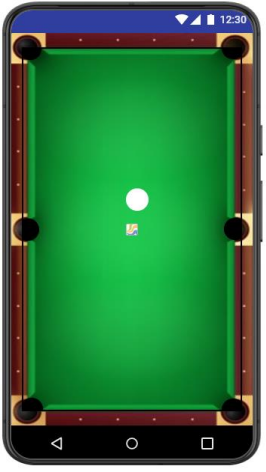

### Print dos Blocos
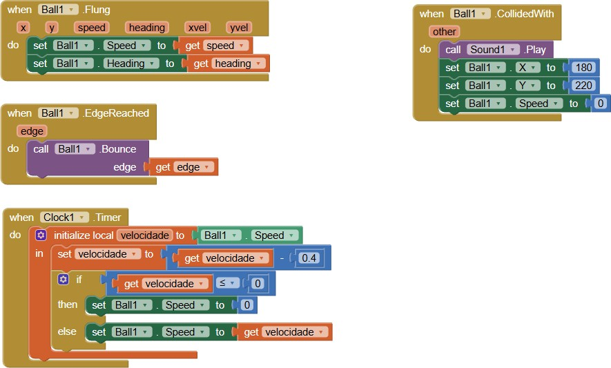
