# 📝 Relatório – App Inventor

## Instituição  
ETEC Vasco Antônio Venchiarutti  

## Curso  
Desenvolvimento de Sistemas  

## Turma  
2°C1 - Turma A 

## Autores  
- Ana Clara Soares da Silva Lima
- Henrique Suhr

---

# Projeto 1 – Primeiro Aplicativo (pg. 27)

## Descrição  
🎯Objetivo: exibir uma mensagem clicando em um botão

⚙️Funcionamento: clicando no botão "CliqueAqui" a mensagem "Olá Mundo" será exibida acima da imagem colocada. Além do botão principal, há também o botão "Limpar" que apaga a mensagem exibida anteriormente.

### Alterações em relação à apostila
- Mudança da imagem utilizada

## Prints do design
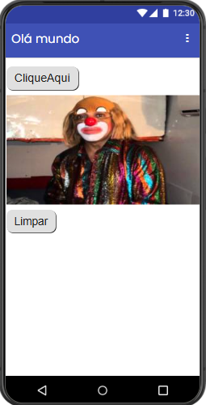
## Prints dos blocos
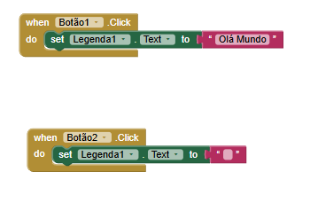
---

# Projeto 2 – Segundo Aplicativo (pg. 46)

## Descrição  
🎯Objetivo: desenhar na tela com a cor selecionada

⚙️Funcionamento: acima da imagem são colocados quatro botões "amarelo", "azul", "verde" e "vermelho", clicando em um deles a cor do pincel é alterada para o que foi seleciondo. É possível desenhar apenas encima da imagem. Abaixo o botão "Limpar" apaga os traços feitos.

### Alterações em relação à apostila
- Mudança da imagem utilizada

## Prints do design
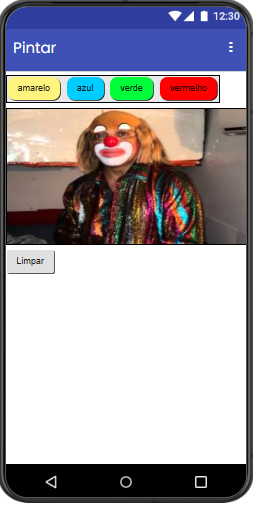
## Prints dos blocos
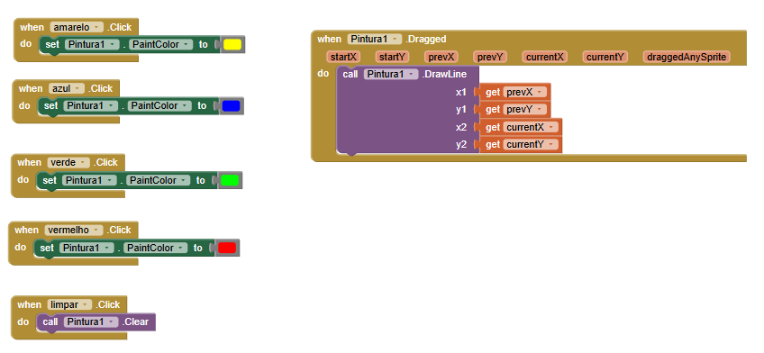
---

# Projeto 3 – Terceiro Aplicativo (pg. 56)

## Descrição  
🎯Objetivo: reproduzir um som ao clicar no botão/imagem

⚙️Funcionamento: clicando na imagem do liquidificador é reproduzido um som, ao mesmo tempo que faz o aparelho vibrar. Os efeitos duram apenas por alguns segundos.

### Alterações em relação à apostila
- Nenhuma alteração feita

## Prints do design
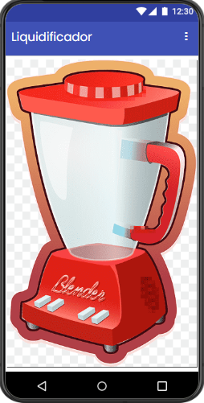
## Prints dos blocos
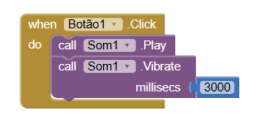
---

# Projeto 4 – Quarto Aplicativo (pg. 64)

## Descrição  
🎯Objetivo: tirar fotos com a camêra fotográfica

⚙️Funcionamento: clicando no botão "Tirar foto" a câmera fotográfica do aparelho é aberta, tirando a foto é possível escolher descartá-la ou mantê-la. Escolhendo a segunda opção, a imagem aparecerá na tela. Clicando no botão "Fechar" a aplicação é encerrada.

### Alterações em relação à apostila
- Nenhuma alteração feita

## Prints do design
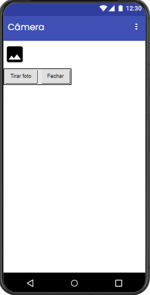
## Prints dos blocos

---

# Projeto 5 – Quinto Aplicativo (pg. 69)

## Descrição  
🎯Objetivo: alternar entre diferentes telas

⚙️Funcionamento: na tela principal "Tela 1" há dois botões "Tela 1" e "Tela 2", clicando nestes botões o aplicativo redireciona para a tela selecionada. Em ambas as telas secundárias há outro botão "Voltar Tela Inicial", que volta para a tela principal.

### Alterações em relação à apostila
- Mudança das imagens utilizadas

## Prints do design
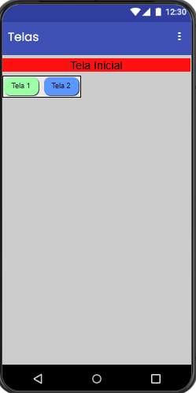
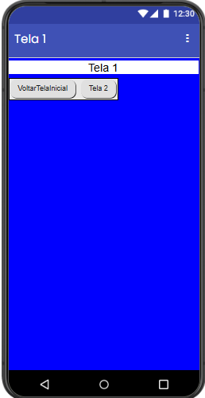
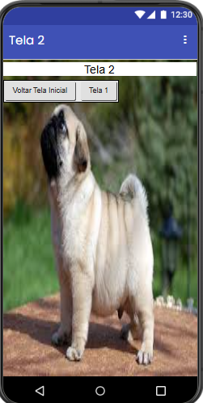
## Prints dos blocos
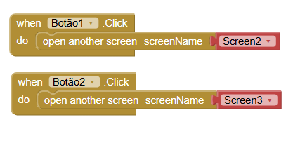
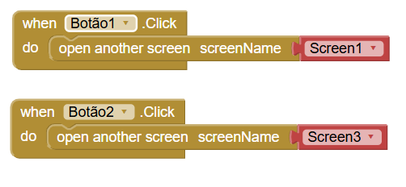
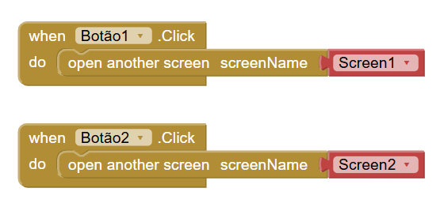
---

# Projeto 6 – Sexto Aplicativo (pg. 82)

## Descrição  
🎯Objetivo: receber e exibir o nnome digitado.

⚙️Funcionamento: na tela há uma caixa de texto, onde será digitado um nome qualquer, e logo abaixo um botão "Clique aqui", após digitar o nome e clicar no botão mais abaixo será exibida a seguinte mensagem: "Olá (nome)"

### Alterações em relação à apostila
- Nenhuma alteração feita

## Prints do design
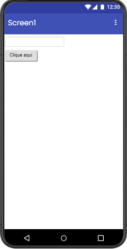
## Prints dos blocos
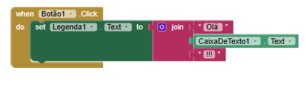
