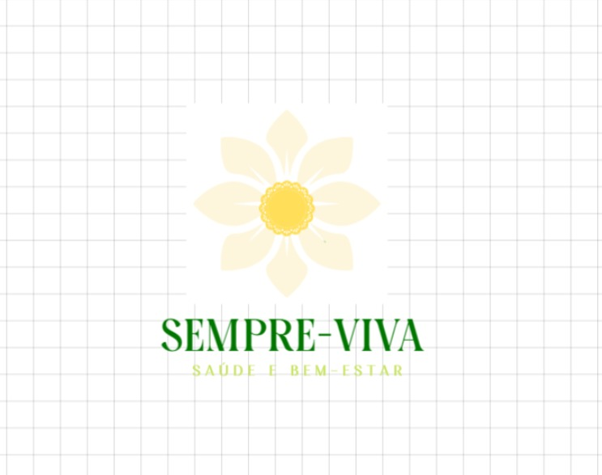
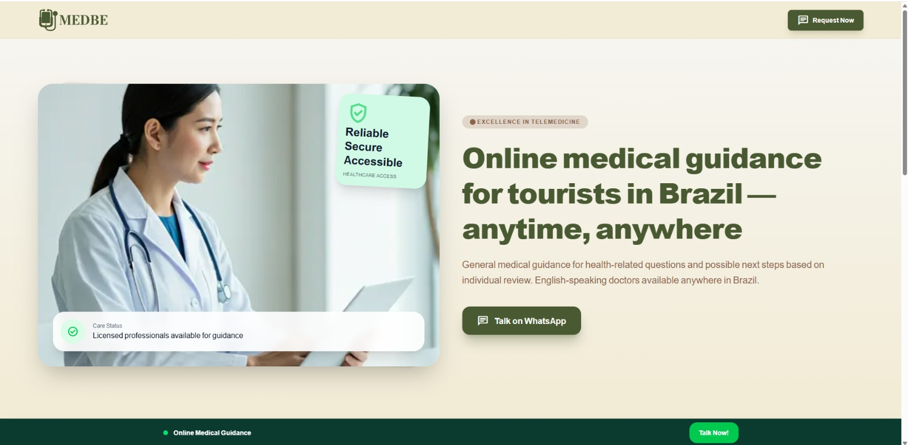

## EMPRESA EM PARCERIA COM O MINISTÉRIO PÚBLICO DE SAÚDE  

### TEMA: alimentação, saúde e esportes (saúde da população brasileira como um todo).

### NOME: sempre-viva

Explicação: sempre-viva é uma flor que representa a vida e é encontrada em territorio brasileiro, combina com o site por ele ser em parceria com o governo.

### OBJETIVO: auxílio na melhora da saúde da população (incentivo da alimentação correta, pratica de atividades físicas, etc.) 

### O QUE O USUÁRIO ENCONTRARÁ: cadastro,  ficha de saúde (preenchida pelo usuário), tela de sugestão de receitas/alimentos saudáveis (bem como a opção de montar uma dieta com auxílio de profissionais), tela de sugestão de atividades físicas/esportes (ou montagem de um plano de treinos acompanhado por um profissional), tela de agendamento à consultas, 

### PROBLEMA A SER RESOLVIDO: falta da pratica de atividade física e má alimentação no Brasil. 

### INFORMAÇÕES/SERVIÇOS:  serviços: sugestão de receitas saudáveis e atividades físicas/esportes (específicas para cada usuário), acesso a agendamento de consultas (setor público/privado por meio de planos de saúde), 

### PÚBLICO-ALVO: população brasileira 

### INSPIRAÇÕES: 

#### Inspiração para a logo

#### Inspiração para telas e cores que serão utilizadas no site
